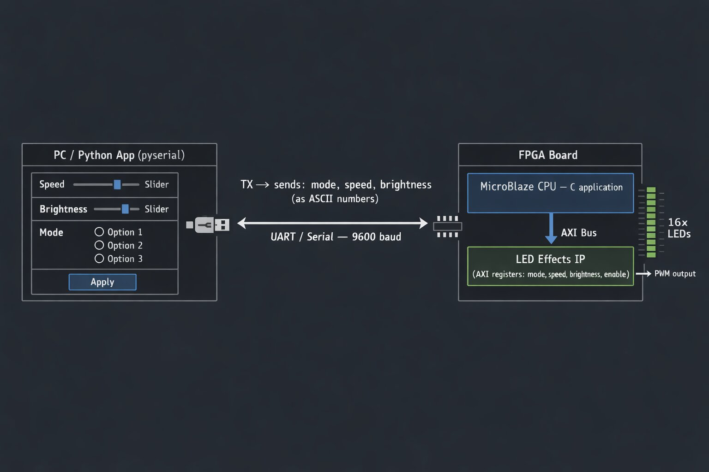

Hi, I'm Daniel

Microelectronics, optoelectronics and nanotechnologies student at the Gheorghe Asachi Univeristy of Iași, Romania
Interested in FPGA based systems and embedded programming - but open to anything new

# Technologies used

* Xilinx Vivado - Verilog IP-core developing and system designs
* Xilinx Vitis  - C applications used for platforms created from bitstream generated files
* Visual Studio Code - Python applications for interaction: human-FPGA through computer interface
* FPGA board - Digilent Nexys 4 DDR https://digilent.com/reference/programmable-logic/nexys-4-ddr/start?srsltid=AfmBOoqPtY8xdySjfTk6pNta6xX6cTdtBJwg6BfXt02vmRZH6LxWO5sT
  
# Projects

## FPGA Embedded LED Controller
# DEMO : https://www.youtube.com/watch?v=eJfeQOS3ic8
## System Diagram

FPGA-based LED effects controller built with a custom AXI IP, controlled by a MicroBlaze system and a Python GUI over UART serial cable.

### Steps
-Made a custom AXI IP-core, where I designed the logic for the LED controller, which includes: 
* mode(off,running lights,blink,counter);
* speed(1-100 steps/second);
* brightness(0-100%, with PWM).

-Created the system design block, powered by the MicroBlaze processor, integrated the custom peripheral IP and UART IP for serial communication.

-Developed a C code, where the parameters are accessed via the peripheral memory addresses.

-Developed a Python code for a GUI which communicates with the COM port to the FPGA through the serial cable.
